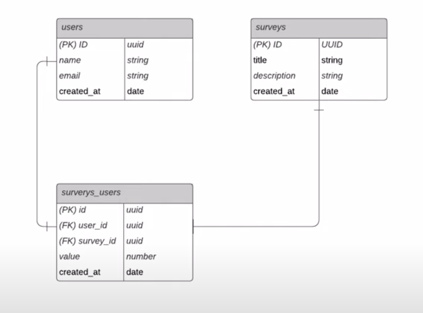

# 🚀 Rocktseat NodeJS NPS API

This app was developed during NLW 4.0 (Next Level Week), and aims to simulate an NPS (Net Promoter Score) API using NodeJS.

## 💻 Technologies

- NodeJS
- Express
- TypeScript
- TypeORM
- Jest
- Supertest

## 🧰 Architecture

### Database



## 💿 Installation

```sh
# Install dependencies
yarn

# Run migrations to create SQLite database
yarn typeorm migration:run
```

## 🏃 Running

```sh
yarn dev
```

## ✅ Tests

```sh
yarn test
```
